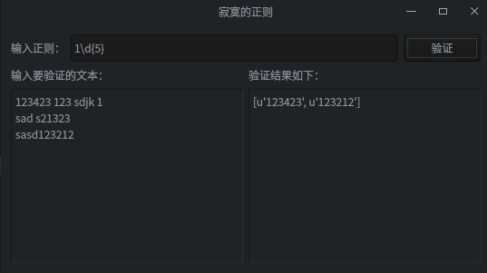

## 题目
正则表达式查询工具——用户可以输入一段文本，在另外的控件里输入一个正则表达式。运行以后会返回匹配的内容或者正则表达式中的错误。
## 结果

## 代码
```python
#!/usr/bin/env python3
#-*-coding:utf-8-*-

import sys
import re
from PyQt5.QtWidgets import (QApplication,QWidget,QVBoxLayout,QGridLayout,QFormLayout,QLabel,QLineEdit,QTextEdit,QPushButton)

class RegularExp(QWidget):

    def __init__(self,parent=None):
        super(RegularExp,self).__init__(parent)
        self.initUI()

    def initUI(self):
        self.setWindowTitle("寂寞的正则")
        self.createUI()
        
        # 主布局采用垂直布局
        mainLayout = QVBoxLayout() 
        mainLayout.addLayout(self.top)
        mainLayout.addLayout(self.down)
        self.setLayout(mainLayout)

    def createUI(self):
        # 上部分的输入框
        up = QGridLayout()
        self.regEdit = QLineEdit("reg")
        btnOK = QPushButton("验证")
        btnOK.clicked.connect(self.verify) # 绑定事件
        up.addWidget(self.regEdit,1,0)
        up.addWidget(btnOK,1,1)

        self.top = QFormLayout()
        lb_top = QLabel("输入正则：")
        self.top.addRow(lb_top,up)

        # 下面两个采用水平布局的文本框
        # 一个用户输入，一个用于显示结果
        lb_in = QLabel("输入要验证的文本：")
        lb_out = QLabel("验证结果如下：")
        self.txt_in = QTextEdit()
        self.txt_out = QTextEdit()
        self.txt_out.setReadOnly(True)
        self.down = QGridLayout()
        self.down.addWidget(lb_in,1,0)
        self.down.addWidget(lb_out,1,1)
        self.down.addWidget(self.txt_in,2,0)
        self.down.addWidget(self.txt_out,2,1)

    '''
    正则验证
    '''
    def verify(self):
        self.txt_out.setText("")
        reg = self.regEdit.text()
        txtIn = self.txt_in.toPlainText()
        if reg=='' or txtIn=='':
            return
        m = re.findall(reg,txtIn)
        if len(m)==0:
            self.txt_out.setText("无结果")
        else:
            self.txt_out.setText(str(m))

if __name__=='__main__':
    app = QApplication(sys.argv)
    rep = RegularExp()
    rep.show()
    app.exec_()

```


